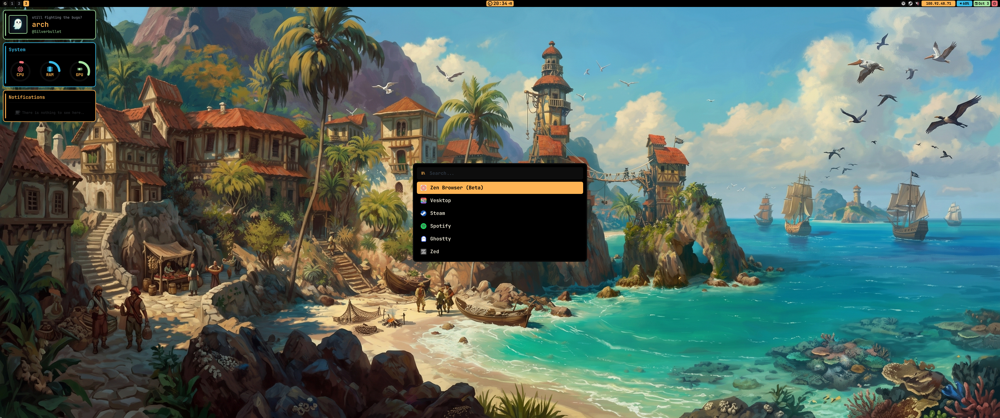
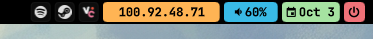
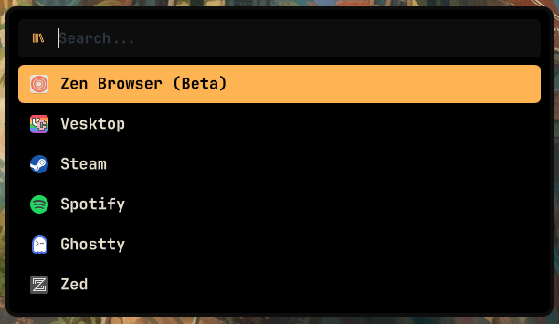
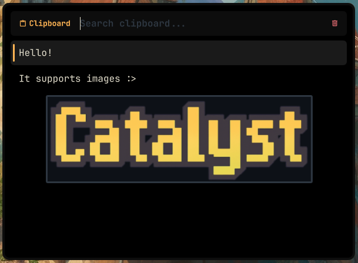
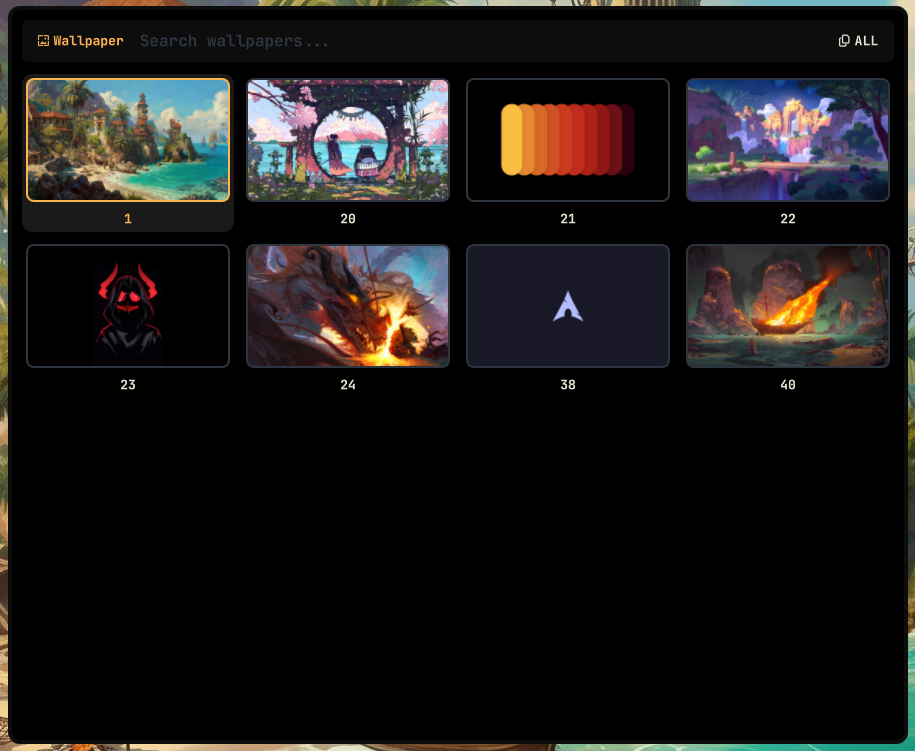
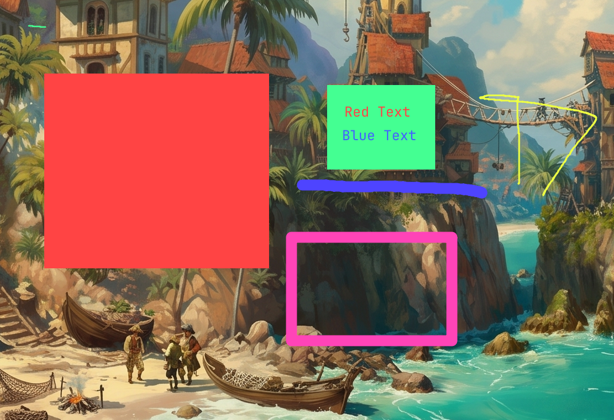
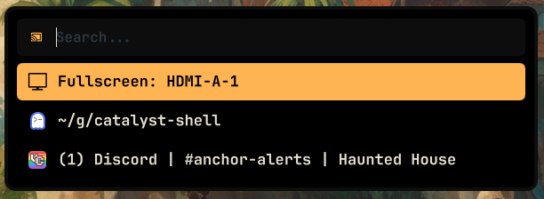
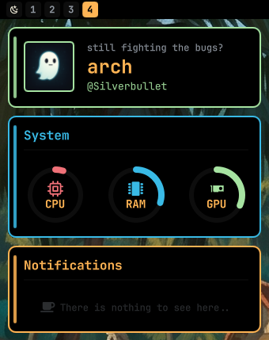

# catalyst-shell

<div align="center">
  
</div>

---

This project started out because I didn't like the way noctalia was going anymore. <br>
It started out as a fork of [melatonia's meloworld](https://github.com/melatonia/meloworld-dotfiles/tree/main) but, quickly got changed over time.

Catalyst-shell has borrowed alot from melatonia but, improves in speed, markup tools, and more. <br>
Will be maintained for mangowm and become more personalized over time.

## Editing the bar

Each side of the bar has its own file. Widgets live in `shell/bar/widgets/`.

| Side   | File                      |
| ------ | ------------------------- |
| Left   | `shell/bar/LeftBar.qml`   |
| Center | `shell/bar/CenterBar.qml` |
| Right  | `shell/bar/RightBar.qml`  |

To add a widget, add a line inside the file's `Row`:

```qml
WidgetName { anchors.verticalCenter: parent.verticalCenter }
```

To remove one, delete its line. To reorder, move the line up or down.

Example, `shell/bar/RightBar.qml`:

```qml
Row {
    spacing: 4

    TrayBar { anchors.verticalCenter: parent.verticalCenter }
    TailscaleWidget { anchors.verticalCenter: parent.verticalCenter }
    AudioWidget { anchors.verticalCenter: parent.verticalCenter }
    DateWidget { anchors.verticalCenter: parent.verticalCenter }
    SessionWidget { anchors.verticalCenter: parent.verticalCenter }
}
```

Order will be from left to right, so TrayBar - Tailscale - Audio - Date - Session

Example:
<div align="center">
  
</div>

## Launcher

Opened with `catalyst-launcher` as a command or keybind. Type a prefix in the search bar to switch mode:

| Prefix | Mode        |
| ------ | ----------- |
| `/w`   | Wallpaper   |
| `/c`   | Clipboard   |
| `/h`   | Hidden apps |

Examples:
<div align="center">
  
</div>

<div align="center">
  
</div>

<div align="center">
  
</div>

## Media player

Click the clock widget, defined in `shell/bar/widgets/ClockWidget.qml`, to open a popup showing the currently playing media, using MPRIS.

Example:
<div align="center">
  
</div>

## Screenshots & markup

Pick a region, then edit it before it hits the clipboard.

| Command                    | Does                                         |
| -------------------------- | -------------------------------------------- |
| `catalyst-screenshot`      | sends to clipboard                           |
| `catalyst-screenshot-save` | saves to `~/Pictures/Screenshots`            |
| `catalyst-markup`          | spawns markup editor then sends to clipboard |

Shortcuts:

- `B` box tool
- `P` pencil tool
- `F` fill tool
- `T` text tool
- `M` move tool
- `C` toggle color picker
- `S` toggle size picker
- `Ctrl+Z` undo
- `Enter` copy to clipboard
- `Esc` cancel

Example:
<div align="center">
  
</div>

## Screensharing

When a screen-sharing portal asks what to share, `catalyst-screenshare-chooser` opens a picker to choose a monitor or a single window.

Example:
<div align="center">
  
</div>

## Notifications

Apps send notifications over the standard desktop notification protocol, the same one `notify-send` uses. <br>
`shell/notifications/NotificationPopup.qml` listens for them and shows a popup toast.

All notifications are kept in a history, shown in the notification center at `shell/dashboard/NotificationSection.qml`. <br>
Open it with `catalyst-dashboard` as a command or keybind.

Example:
<div align="center">
  
</div>
